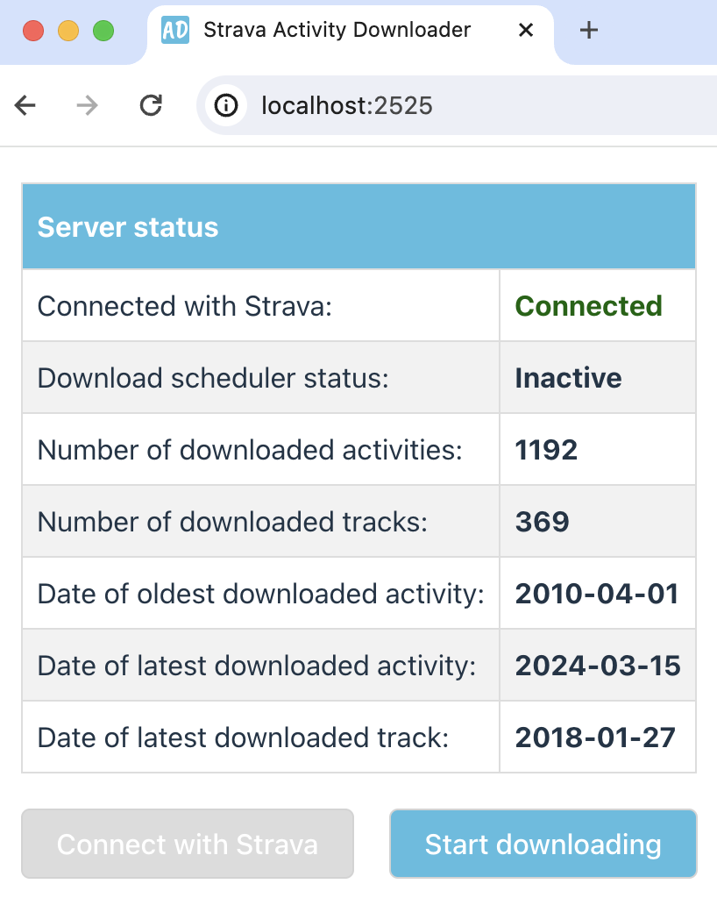

# Strava Activity Downloader

This is a Rust server that downloads all Strava activities and the corresponding activity streams (tracks)
for the authenticated user. The activities are stored in local a [SQLite 3](https://www.sqlite.org) database;
the activity streams are written to GPX files.

The downloader respects the rate limits defined for your Strava API client.
By default, the built-in scheduler issues a request every 10 seconds.
The delay can be adapted in the server configuration.
When the daily request limit is reached, the scheduler suspends.
The downloading can be resumed later from point where it stopped.
This also works after a server restart.

The server can be controlled by a React UI, which is also part of this project. 
It takes care of authenticating the application with Strava, lets you start and stop the downloading,
and shows the download progress.



## Preconditions
#### Required Tools
* Rust with `cargo` for the server.
* [Node.js](https://docs.npmjs.com/downloading-and-installing-node-js-and-npm) with `npm` for the UI.
* Optionally [sqlite3](https://www.sqlite.org) for querying the local DB.

#### Strava API Client
To connect to Strava, you need a Strava API client.
If you don't have one already, you can register a new API client at https://www.strava.com/settings/api.

Make sure that the `Authorization Callback Domain` of your client is `localhost:2525`.

You will need values for `Client ID` and `Client Secret` of your API client for configuring the server (see below).

## Setup

#### Build the Server
```shell
ce <project>/server
cargo build
```

#### Configure the Server
Create a server configuration from the template:
```shell
cp conf/application.yaml.example conf/application.yaml
```
Then edit `conf/application.yaml` and set the `Client ID` and `Client Secret` of your Strava API client:
```yaml
oauth:
  client_id: "<your-strava-client-id>"
  client_secret: "<your-strava-client-secret>"
```

#### Build the Web UI
```shell
cd <project>/web
npm install
npm run build
cd ..
```

## Running

Start the server:
```shell
RUST_LOG=info cargo run 
```
Then point your browser to http://localhost:2525 and start downloading your activities!

#### Dev Mode

It is also possible to run the web UI in vite's [preview mode](https://vitejs.dev/guide/cli#vite-preview).
The preview server runs at port `2020`. To ensure that the Rust server redirects to the vite preview server
after authenticating with Strava, the `target_url` configured in `conf/application.yaml` should be
```yaml
oauth:
  target_url: "http://localhost:2020" # Redirect to after authentication
```
In addition, the React app needs to fetch the data from an absolute address. In [App.tsx](./web/src/App.tsx) change
```javascript
const SERVER_URL = 'http://localhost:2525'
```
Then start the dev server in another shell (tab):
```shell
cd <project>/web
npm run dev
```
Point your browser to http://localhost:2020.

## Server API
Instead of using the web UI, the server can be controlled via REST API.
For usability, all endpoints use `GET`.
A browser is only needed for the authorization,
where Strava redirects to its login and authorization pages.

#### Authorize
```
GET /authorize
```
starts the authorization with Strava.
Under the hood, the server performs an [OAuth 2.0 Authorization Code Grant](https://oauth.net/2/grant-types/authorization-code/) flow
to obtain a Strava token. At the end of the process, the server redirects to
the URL configured at `oauth.target_url` in `conf/application.yaml`.
By default, this is the web UI exposed at the root path of the server.

#### Status
```
GET /status
```
opens an [SSE](https://en.wikipedia.org/wiki/Server-sent_events) channel that receives
server-status updates as JSON objects in the SSE `data` field. An example object is
```json
{
  "authorized": true,
  "download_state": "Inactive",
  "activity_stats": {
    "act_count": 1191,
    "act_min_time": "2010-04-01T15:13:08Z",
    "act_max_time": "2024-03-10T10:16:17Z",
    "trk_count": 380,
    "trk_max_time": "2016-10-03T14:00:56Z"
  }
}

```
#### Toggle
```
GET /toggle
```
starts the download process or stops it, depending on the previous state.
The request returns the name of the new state (e.g. `"Inactive"`).

## Using the Data
The server stores the GPX files in the `data` folder, grouped by year and month.
The file names refer to the activity ids provided by Strava. An example path is
```
./data/2024/03/7654321123.gpx
```
To read the GPX files from oldes to newest, you can either sort the files by name
(as Strava uses increasing activity ids), or by file data (because the server downloads the
files in chronological order).

If you have `sqlite3` installed, you can also query the activity database (`activity.db`).
This example query selects all activities of 2024:
```
sqlite3 activity.db "select * from activity where substr(start_date, 1, 4) = '2024'"
```
The `id` column is the primary key and holds the activity id.
Column `gpx_fetched` shows the GPX download status:
0 means: "not yet downloaded",
1 means "GPX downloaded" (there is a corresponding file in folder `data`), and
2 means "the activity does not have a track".

Note that you can reveal the column names and format the results like so:
```
sqlite3 activity.db -header -column "select * from activity"
```
